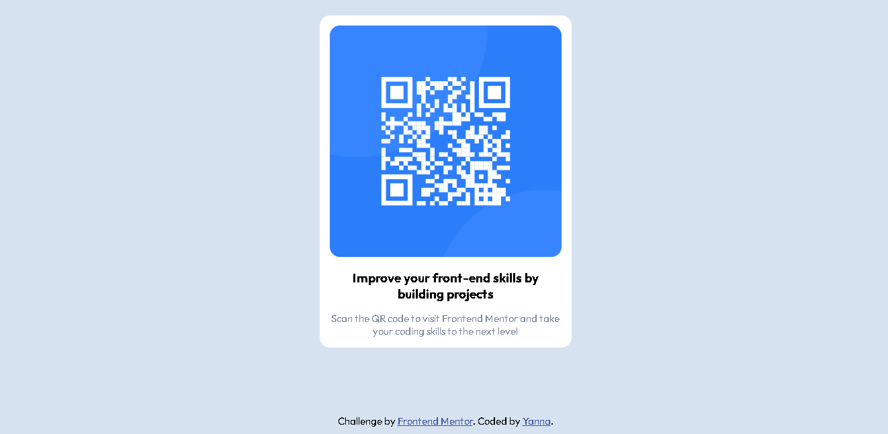

# Frontend Mentor - solução de componente de código QR

Esta é uma solução para o [desafio do componente de código QR no Frontend Mentor](https://www.frontendmentor.io/challenges/qr-code-component-iux_sIO_H). Os desafios do Frontend Mentor ajudam você a melhorar suas habilidades de codificação criando projetos realistas.

## índice

- [Vião geral](#visaogeral)
  - [Captura de tela](#screenshot)
  - [Links](#links)
- [Meu processo](#my-process)
  - [Construído com](#built-with)
  - [O que eu aprendi](#what-i-learned)
- [Author](#author)
- [Acknowledgments](#acknowledgments)

## Visão geral

### Captura de tela

### Links

- Live Site URL: (https://yannacodek.github.io/qr-code-component-project/)

### Construído com

- HTML5 semântico
- Propriedades personalizadas de CSS
- Flexbox

### O que eu aprendi

Neste simples projeto pude práticar e testar meus conhecimentos em HTML e CSS. Foi de muito valor construir um projeto do zero, baseado no resultado esperado como indicado pelo desafio da Frontend Mentor.

## Autor(a)

- Website - [Yanna](https://github.com/yannackn)
- Frontend Mentor - [@yannackn](https://www.frontendmentor.io/profile/yannackn)
